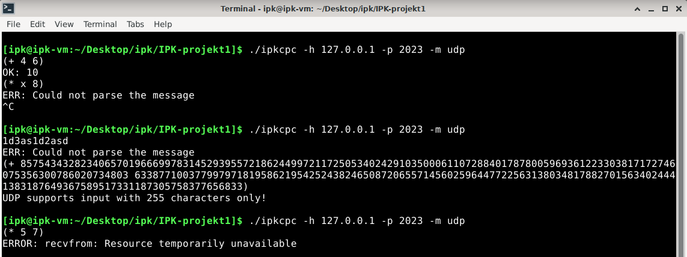

# IPK-projekt1
## Autor 
Simona Jánošíková (xjanos19)

## Zadanie projektu 
Úlohou bolo naiplementovať klienta pre IPK Calculator Protocol. Klient by mal vedieť komunikovať pomocou TCP a UDP protokolu so serverom používajúcim IPKCP protokol.

## Implementácia
Klient *ipkcpc* je naimplementovaný v jazyku C, revízia C11 v prostredí UNIX OS.

### Preklad projektu
Na preklad projektu je potrebný program GNU MAKE s doporučeným prekladačom gcc verzie 7.5.0 . Preklad projektu vykonáte príkazom **make**. K prekladu projektu sú potrebné následovné knižnice:
* #include <arpa/inet.h>
* #include <ctype.h>
* #include <netdb.h>
* #include <netinet/in.h>
* #include <signal.h>
* #include <stdbool.h>
* #include <stdio.h>
* #include <stdlib.h>
* #include <string.h>
* #include <sys/socket.h>
* #include <sys/time.h>
* #include <sys/types.h>
* #include <unistd.h>

### Spustenie projektu
Projekt je po preklade možné spustiť príkazom: 
```
$ ./ipkcpc -h < host > -p < port > -m < mode > 
```
**host** je IPv4 adresa serveru \
**port** je číslo portu servera\
**mode** je komunikačný protokol, *tcp* alebo *udp*\

príklad korektného spustenia: 
```
$ ./ipkcpc -h 127.0.0.1 -p 2023 -m tcp
```

### Používanie klienta *ipkcpc*
**TCP MÓD** \
Klient po spustení v móde TCP očakáva od uživateľa vstupnú hlášku *HELLO*, na ktorú odpovie. Potom mu je možné posielaľ príkazy v tvare *SOLVE (operátor číslo1 číslo2)*, pričom *operátor* je ľubovoľný zo znakov +, -, *, /. Pre ukončenie spojenia je potreba napísať hlášku *BYE*.\
Príklad použitia TCP módu:
```
$ ./ipkcpc -h 127.0.0.1 -p 2023 -m tcp 
HELLO
HELLO
SOLVE (* 2 3)
RESULT 6
BYE
BYE
```

**UDP MÓD** \
Klient po spustení v móde UDP čaká rovno na príkaz v tvare *(operátor číslo1 číslo2)*, pričom *operátor* je ľubovoľný zo znakov +, -, *, /. Pre ukončenie spojenia je potrebné zadať do terminálu príkaz CTRL-C. \
Príklad použitia TCP módu:
```
$ ./ipkcpc -h 127.0.0.1 -p 2023 -m tcp 
(* 2 3)
OK: 6
CTRL^C
```

### Popis implementácie
Prvým úkonom klienta je overenie, či sú argumenty zadané korektne, to znamená že skontroluje ich počet, korektnosť prepínačov a korektnosť formátu IPv4 adresu, portu a módu. Následne sú deklarované všetky potrebné premenné na komunikáciu v obdivoch módoch. Po definovaní IP adresy, portu a módu sa klient presúva do časti, kde začne komunikovať so serverom. \
V TCP móde sa klient pokúša nadviazať spojenie so serverom a v odpovedi buď spojenie ukončí(v prípade chyby alebo po poslaní hlášky *BYE* klientom), alebo odpovedá buď výsledkom matematického príkladu alebo hláškou *HeLLO*. Po zadaní príkazu CTRL-C sa spojenie neukončí ihneď, ale odošle sa hláška *BYE* serveru a čaká sa následne na jeho odpoveď. Až potom sa ukončí jeho spojenie. \
V UDP móde klient odošle načitaný príkaz serveru a čaká na odpoveď. Ak server do 10 sekúnd neodpovie, tak sa spojenie preruší. Tento mód je taktiež nazývaný aj binárnym, pretože sa mu príkazy posielajú v inom formáte ako v TCP, s vopred zadanými práznakmi na jednotlivých bitoch. Spojenie sa prerušuje výhradne pomocou CTRL-C.

## Testovanie
### Testovanie argumentov


### Testovanie TCP módu


### Testovanie UDP módu


## Zdroje 
[IPK - Stubs](https://git.fit.vutbr.cz/NESFIT/IPK-Projekty/src/branch/master/Stubs/cpp)