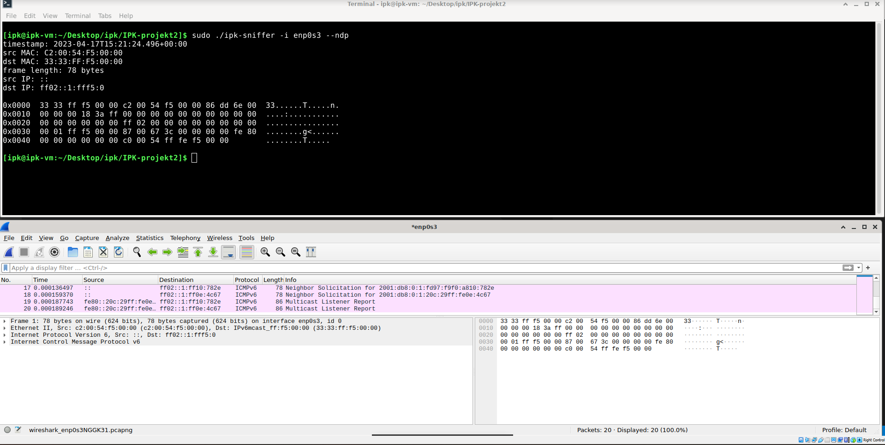

#   IPK Project 2 - ZETA: Network sniffer
## Autor 
[Simona Jánošíková (xjanos19)](https://git.fit.vutbr.cz/xjanos19/IPK-projekt2)

## Zadanie projektu 
Cieľom projektu bolo implementovať sieťový sniffer, ktorý je schopný na určitom sieťovom rozhraní zachztávať a filtrovať packety na protokoloch TCP, UDP, ICMPv4, ICMPv6, ARP, NDP, IGMP, MLD. Celé zadanie projektu je dostupné na [tejto stránke](https://git.fit.vutbr.cz/NESFIT/IPK-Projekty/src/branch/master/Project%202/zeta/README.md).

## Teória  
* **Sieťový sniffer** - je počítačový program alebo zariadenie, ktoré umožňuje zachytávať, zaznamenávať a analyzovať komunikáciu v počítačovej sieti.  
* **Paket** - Paket je blok prenášaných dát v počítačovej sieti, teda ucelený blok dát, ktorý sa v sieti prenáša a spracováva ako celok. Je nedeliteľný na menšie časti. Paket má svoju štruktúru, obsahuje hlavičku, adresy odosielateľa a prijímateľa a kontrolnú sumu (CRC) pomocou ktorej zisťujeme jeho integritu.
* **Rozhranie** - označuje zariadení, program alebo formát, zabezpečujúci správnu komunikáciu a prenos dát medzi odlišnými zariadeniami alebo programami.
* **IP adresa** - alebo adresa internetového protokolu, je unikátna číselná značka pridelená každému zariadeniu pripojenému k počítačovej sieti, ktorá používa internetový protokol na komunikáciu. IP adresy slúžia na dva hlavné účely: identifikujú hostiteľa alebo sieťové rozhranie a poskytujú umiestnenie hostiteľa v sieti. Existujú dve verzie IP adries, IPv4 a IPv6. IPv4 adresy majú dĺžku 32 bitov, zatiaľ čo IPv6 adresy majú dĺžku 128 bitov.
* **Sieťový protokol** - je skupina pravidiel, ktoré ovládajú to, ako sú údaje prenášané medzi aplikáciami, v tomto kontexte medzi klientom a databázovým serverom.
* **TCP (Transmission Control Protocol)** - je protokol, vďaka ktorému môžu programy na počítačoch v sieti vytvárať medzi sebou spojenia (connections), ktorými je možné posielať dáta. Protokol pritom zaručuje, že dáta odoslané z jedného konca spojenia budú prijaté na druhej strane spojenia v rovnakom poradí a bez chýbajúcich častí.
* **UDP (User Datagram Protocol)** - je protokol, ktorý prenáša datagramy medzi počítačmi v sieti, ale na rozdiel od TCP nezaručuje, že prenášaný paket sa nestratí, že sa nezmení poradie paketov, ani že sa niektorý paket nedoručí viackrát.
* **ICMP (Internet Control Message Protocol)** - je protokol, ktorý používajú operačné systémy počítačov v sieti na odosielanie chybových správ, napríklad na oznámenie, že požadovaná služba nie je dostupná alebo že potrebný počítač alebo router nie je dosiahnuteľný. ICMP sa svojím účelom líši od TCP a UDP protokolov tým, že sa obvykle nepoužíva sieťovými aplikáciami priamo. Verzia ICMP pro IPv4 je známa ako ICMPv4.
* **ICMPv6 (Internet Control Message Protocol Version 6)** - je nová verzia ICMP protokolu a je neoddeliteľnou súčasťou architektúry IPv6, ktorá musí byť plne podporovaná všetkými implementáciami na všetkých uzloch. ICMPv6 kombinuje funkcie, ktoré boli predtým rozdelené medzi viacero protokolov (ICMP, IGMP, ARP) a zároveň poskytuje mnohé zjednodušenia najmä odstránením zastaraných typov správ, ktoré sa už nepoužívajú.
* **ARP (Address Resolution Protocol)** - je protokol, ktorého úlohou je zisťovanie fyzickej adresy hostiteľa, ak je známa iba jeho IP adresa, alebo iná adresa sieťovej vrstvy. Primárne je teda určený na získanie MAC adresy z IP adries na lokálnej sieti LAN.
* **NDP (Neighbor Discovery Protocol)** - je protokol, ktorý je používaný v IPv6 pre autokonfiguráciu sieťových rozhraní. Pracuje iba v podsieti s prefixom /64 a umožňuje zaistiť mnoho technických detailov potrebných pre funkčnú komunikáciu.
* **IGMP (Internet Group Management Protokol)** - je protokol, ktorý rozširuje požiadavky na implementáciu protokolu IP (IPv4) o podporu IP multicastu. Využíva sa na dynamické prihlasovanie a odhlasovanie zo skupiny pri multicastovom routeri vo svojej lokálnej sieti. IGMP protokol rieši aj situáciu, kedy sú v sieti pripojené dva a viac multicastových routerov, pretože potom by mohlo dôjsť v sieti k šíreniu nadbytočných informácií.
* **MLD (Multicast Listener Discovery)** - je protokol, ktorý je súčasťou balíka IPv6. MLD používajú smerovače IPv6 na zisťovanie poslucháčov multicast na priamo pripojenom odkaze, podobne ako sa v IPv4 používa protokol IGMP. Protokol je zabudovaný v ICMPv6 namiesto použitia samostatného protokolu.

## Implementácia
Sieťový sniffer je naimplementovaný v jazyku C v prostredí UNIX OS.

### Preklad projektu
Na preklad projektu je potrebný program GNU MAKE s doporučeným prekladačom gcc verzie 7.5.0 . Preklad projektu vykonáte príkazom make. K prekladu projektu sú potrebné následovné knižnice:
* #include <arpa/inet.h>
* #include <netinet/ether.h>
* #include <netinet/if_ether.h>
* #include <netinet/ip_icmp.h>
* #include <netinet/ip6.h>
* #include <netinet/tcp.h>
* #include <netinet/udp.h>
* #include <pcap.h>
* #include <signal.h>
* #include <stdbool.h>
* #include <stdio.h>
* #include <stdlib.h>
* #include <string.h>
* #include <time.h>
* #include <unistd.h>

### Spustenie projektu
Projekt je po preklade možné spustiť príkazom:
```
$ sudo ./ipk-sniffer [-i interface | --interface interface] {-p port [--tcp|-t] [--udp|-u]} [--arp] [--icmp4] [--icmp6] [--igmp] [--mld] {-n num}
```

príklad korektného spustenia: 
```
$ sudo ./ipk-sniffer -i eth0 -p 23 --tcp -n 2
```

### Popis implementácie
* **Spracovanie argumentov**  
Argumenty programu sú spracované funkciou *parseArguments*, ktorá prejde zadané argumenty a na základe toho zadá hodnoty *true* do premenných v štruktúre *arguments*. Premenné v tejto štruktúre sú: *interfcae, tcp, udp, port, icmp4, icmp6, arp, ndp, igmp, mld, n*. Tieto premenné okreme *p, n* a *interface* značia boolovkú hodnotu *true* v prípade, že bol zadaný argument daného protokolu, inak obsahujú flag *false*. Premenná *interface* obsahuje zadané rozhranie, inak je jeho hodnota *Null*. Premenná *p* obsahuje číslo zadaného portu a premenná *n* počet packetov na zobrazenie. 
* **Výpis dostupných rozhraní**  
V prípade, že premenná *interface* nebola špecifikovaná, tak sa vypíšu všetky dostupné rozhrania. Tento výpis zabezpečí funkcia *printInterfaces*. Nájdenie všetkých dostupných rozhraní zabezpečí funkcia *pcap_findalldevs* z knižnice *pcap.h*.
* **Zabezpečenie spojenia s rozhraním**  
Zabezpečenie spojenia s rozhraním prebieha vo funkcií *startConnectionWithPackets* Otvorenie spojenia s rozhraním zabezpečili funkcie *[pcap_lookupnet](https://www.tcpdump.org/manpages/pcap_lookupnet.3pcap.html)*, ktorá zistí IP adresu a masku zadaného rozhrania; *[pcap_open_live](https://www.tcpdump.org/manpages/pcap_open_live.3pcap.html)*, ktorá otvorí spojenie s rozhraním a funkcia *[pcap_datalink](https://www.tcpdump.org/manpages/pcap_datalink.3pcap.html)*, ktorá sa používa na určenie typu dátového spojenia sieťového rozhrania alebo zachytávaného súboru.
* **Filtrovanie paketov**  
Na zabezpečenie správneho vyfiltrovania packetov slúži funkcia , ktorá vytvorí *filterString* na základe [korektnej syntaxe](https://www.tcpdump.org/manpages/pcap-filter.7.html), ktorú vyžaduje funkcia *pcap_compile*. Filtrovací string *filterString* je vytvorený na základe zadaných argumentov programu. Na kompiláciu *filterString-u* slúži funkcia *[pcap_compile](https://www.tcpdump.org/manpages/pcap_compile.3pcap.html)* a na nasadenie filtra bola použitá funkcia *[pcap_setfilter](https://www.tcpdump.org/manpages/pcap_setfilter.3pcap.html)*.
* **Zachtávanie packetov a výpis informácií o čase a zdrojovej a cieľovej MAC adresy**  
Zachtávanie packetov a výpis informácií zabezpečuje funkcia *catchingPackets*. Určený počet packetov je zachytávaný vo for-cykle pomocou funkcie *[pcap_next](https://www.tcpdump.org/manpages/pcap_next_ex.3pcap.html)*. Následne sa vypíše čas zachytenia packetu pomocou funkcie *printTimestamp*, ktorá vypíše čas zachytenia packetu v korektnom RFC 3339 formáte. Výpis zdrojovej a cieľovej MAC adresy zabezpečuje funkcia *printMAC*, ktorá vypáše tieto MAC adresy v korektnom formáte. Na získanie MAC adresy bolo potrebné pretypovať packet na ethernetovú hlavičku, teda na štruktúru typu *[ether_header](http://www.ethernut.de/api/structether__header.html)*.
* **Rozlíšenie siete, výpis IP adries a potov**  
Na základe typu hlavičky *ether_type* bol detekovaný typ packetu, teda či sa jedná o IPv4, IPv6 alebo ARP packet. Packety v prípade ICMPv4, IGMP nebolo treba detekovať, pretože sa jedná o IPv4 packety a taktiež nebolo potreba rozlišovať ICMPv6, MLD a NDP, pretože sa jedná o IPv6 packety. Po detekcií packetu sa vypíše zdrojová a cieľová IP adresa.  
V prípade IPv4 packetu, ktorý sme získali funkciou *pcap_next* posunutého o 14 bitov. Následne bolo potrebné packet pretypovať do IP havičky, z ktorej sa získala zdrojová a cieľová IPv4 adresa a protokol. V prípade, že bol zadaný TCP alebo UDP protokol, sa vypíše zdrojové a cieľové číslo portu.  
V prípade IPv6 packetu, sa získanie IP a adresy a protokolov podobá na získavanie týchto dát pri IPv4 packetoch. Rozdiel je v tom, že IPv6 hlavička má fixnú veľkosť 40 bitov a IPv4 hlavička má veľkosť nestabilnú.  
V prípade ARP packetu, bola detekcia a výpis IP adries tiež podobná ako u predchádzajúcich packetov, akurát nie je potrebné detekovať protokoly, pretože tie, čo má program zachytávať, neobsahuje.

* **Výpis dát packetu**  
Dáta packetov sa vypisujú vo funkcií *printPcaketData* for-cyklom po riadkoch, kde sa najskôr vypíšu jednotlivé bity a následne ich ASCII reprezentácia.  

Formát výpisu dát programom vyzerá podobne tomu, ktorý vidíte nižšie:  
```
timestamp: 2021-03-19T18:42:52.362+01:00
src MAC: 00:1c:2e:92:03:80
dst MAC: 00:1b:3f:56:8a:00
frame length: 512 bytes
src IP: 147.229.13.223
dst IP: 10.10.10.56
src port: 4093
dst port: 80

0x0000: 00 19 d1 f7 be e5 00 04 96 1d 34 20 08 00 45 00 ........ ..4 ..
0x0010: 05 a0 52 5b 40 00 36 06 5b db d9 43 16 8c 93 e5 ..R[@.6. [..C....
0x0020: 0d 6d 00 50 0d fb 3d cd 0a ed 41 d1 a4 ff 50 18 .m.P..=. ..A...P.
0x0030: 19 20 c7 cd 00 00 99 17 f1 60 7a bc 1f 97 2e b7 . ...... .`z.....
0x0040: a1 18 f4 0b 5a ff 5f ac 07 71 a8 ac 54 67 3b 39 ....Z._. .q..Tg;9
0x0050: 4e 31 c5 5c 5f b5 37 ed bd 66 ee ea b1 2b 0c 26 N1.\_.7. .f...+.&
0x0060: 98 9d b8 c8 00 80 0c 57 61 87 b0 cd 08 80 00 a1 .......W a.......
```

## Testovanie
Výstup programu bol testovaním porovnávaním výstupu v programe Wireshark. Testovacie prípady:  
**Testovanie argumentov**  

test korektne zadaných argumentov je možné zadaním napríklad tohto vstupu, ale aj ľubovolného z argumentov  
testovací vstup: *sudo ./ipk-sniffer -i enp0s3 --tcp --udp --icmp4 --icmp6 --arp --ndp --igmp --mld -p 443 -n 2*  
očakávaný výstup: výpis packetov podľa argumentov

  
testovací vstup: *sudo ./ipk-sniffer ahoj 123*  
očakávaný výstup: error hláška, nesprávne argumenty  


testovací vstup: *sudo ./ipk-sniffer -t -u --tcp*  
očakávaný výstup: error hláška, nesprávne argumenty, duplicitné zadanie argumentu  


testovací vstup: *sudo ./ipk-sniffer -n*  
očakávaný výstup: error hláška, nezadaný počet výpisov  


testovací vstup: *sudo ./ipk-sniffer -p*  
očakávaný výstup: error hláška, nezadané číslo portu

**Testovanie TCP**  
 
testovací vstup: *sudo ./ipk-sniffer -i enp0s3 --tcp*  
očakávaný výstup: výpis TCP packetov  


**Testovanie UDP**  
  
testovací vstup: *sudo ./ipk-sniffer -i enp0s3 --udp*   
očakávaný výstup: výpis UDP packetov  


**Testovanie ICMPv4**  
  
testovací vstup: *sudo ./ipk-sniffer -i enp0s3 --icmp4*  
očakávaný výstup: výpis ICMPv4 packetov  


**Testovanie ICMPv6**  
  
testovací vstup: *sudo ./ipk-sniffer -i enp0s3 --icmp6*  
očakávaný výstup: výpis ICMPv6 packetov  

   
**Testovanie ARP**  
  
testovací vstup: *sudo ./ipk-sniffer -i enp0s3 --arp*  
očakávaný výstup: výpis ARP packetov  

 
**Testovanie NDP**  
  
testovací vstup: *sudo ./ipk-sniffer -i enp0s3 --ndp*  
očakávaný výstup: výpis NDP packetov  

 
**Testovanie IGMP**  

testovací vstup: *sudo ./ipk-sniffer -i enp0s3 --igmp*  
očakávaný výstup: výpis IGMP packetov  

 
**Testovanie MLD**  
testovací vstup: *sudo ./ipk-sniffer -i enp0s3 --mld*  
očakávaný výstup: výpis MLD packetov  

***
## Zdroje   
[Zadanie projektu](https://git.fit.vutbr.cz/NESFIT/IPK-Projekty/src/branch/master/Project%202/zeta/README.md)  
[Manuál pcap library](https://www.tcpdump.org/manpages/pcap.3pcap.html)  
[Wikipédia - pcap library](https://en.wikipedia.org/wiki/Pcap)  
[Wikipédia - sieťový sniffer](https://cs.wikipedia.org/wiki/Analyz%C3%A1tor_paket%C5%AF)  
[Wikipédia - packet](https://sk.wikipedia.org/wiki/Paket_(informatika))  
[Wikipédia - rozhranie](https://cs.wikipedia.org/wiki/Rozhran%C3%AD_(informatika))  
[Wikipédia - IP adresa](https://sk.wikipedia.org/wiki/Adresa_IP)  
[Sieťový protokol](https://www.ibm.com/docs/sk/informix-servers/12.10?topic=network_protocol)  
[Wikipédia - TCP](https://sk.wikipedia.org/wiki/Protokol_riadenia_prenosu)  
[Wikipédia - UDP](https://sk.wikipedia.org/wiki/Pou%C5%BE%C3%ADvate%C4%BEsk%C3%BD_datagramov%C3%BD_protokol)  
[Wikipédia - ICMP](https://cs.wikipedia.org/wiki/ICMP)  
[Wikipédia - ICMPv6](https://cs.wikipedia.org/wiki/ICMPv6)  
[Wikipédia - ARG](https://cs.wikipedia.org/wiki/Address_Resolution_Protocol)  
[Wikipédia - NDP](https://cs.wikipedia.org/wiki/Neighbor_Discovery_Protocol)  
[Wikipédia - IGMP](https://cs.wikipedia.org/wiki/Internet_Group_Management_Protocol)  
[Wikipédia - MLD](https://en.wikipedia.org/wiki/Multicast_Listener_Discovery)  